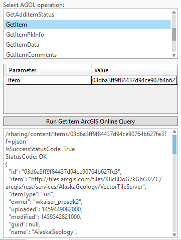

## ArcGISOnlineConnect

<!-- TODO: Write a brief abstract explaining this sample -->
 ArcGISOnlineConnect exercises a collection of programmatic interactions with ArcGIS Online using EsriHttpClient  
   


<a href="http://pro.arcgis.com/en/pro-app/sdk/" target="_blank">View it live</a>

<!-- TODO: Fill this section below with metadata about this sample-->
```
Language:              C#
Subject:               Content
Contributor:           ArcGIS Pro SDK Team <arcgisprosdk@esri.com>
Organization:          Esri, http://www.esri.com
Date:                  5/12/2021
ArcGIS Pro:            2.8
Visual Studio:         2017, 2019
.NET Target Framework: 4.8
```

## Resources

[Community Sample Resources](https://github.com/Esri/arcgis-pro-sdk-community-samples#resources)

### Samples Data

* Sample data for ArcGIS Pro SDK Community Samples can be downloaded from the [Releases](https://github.com/Esri/arcgis-pro-sdk-community-samples/releases) page.  

## How to use the sample
<!-- TODO: Explain how this sample can be used. To use images in this section, create the image file in your sample project's screenshots folder. Use relative url to link to this image using this syntax:  -->
 1. This sample is using the ArcGIS REST API which is published here http://resources.arcgis.com/en/help/arcgis-rest-api    
 1. This solution is using the **Newtonsoft.Json NuGet**.  If needed, you can install the NuGet from the "NuGet Package Manager Console" by using this script: "Install-Package Newtonsoft.Json".  
 1. In Visual Studio click the Build menu. Then select Build Solution.  
 1. Click Start button to open ArcGIS Pro.  
 1. ArcGIS Pro will open.   
 1. Open any project file. Click on the Add-in tab on the ribbon and then on the Show "AgolDockpane" button.  
     
  
 1. On top the AgolDockpane (pane) you find the ArcGIS Online Uri used for the interaction with ArcGIS Online (your portal).  
 1. Select from the 'AGOL operation' listbox by starting with 'GetRest' (go through the list top to bottom doing the following steps):  
 1. Verify the Parameter(s) required for the query you just selected (note: default values are filled in by using return values from previous query results so sequence is important)  
 1. Click on the "Run ... ArcGIS Online Query" button to execute the query.  
 1. View the results in text box on the bottom of the AgolDockpane.    
 1. Please note that ArcGIS Online queries return json and various content returned in json is deserialized into the respective c# class.  
 1. Also note that permissions and content are required for various queries (i.e. content or folder queries)  
 1. The 'GetSearch' query requires a search string which by default is set to 'Redlands'.   
    
 Note: Alternatively, SearchForContentAsync method [topic19135.html](http://pro.arcgis.com/en/pro-app/sdk/api-reference/#topic19135.html) can be used to perform portal item searches.   
 ```cs
  //Create the Query and the params
var pqp = PortalQueryParameters.CreateForItemsOfType(portalItemType, searchString); //overloaded
 //Search active portal
 PortalQueryResultSet<PortalItem> results = await ArcGISPortalExtensions.SearchForContentAsync(portal, pqp);
 //Iterate through the returned items for THE item.
 var myPortalItem = results.Results?.OfType<PortalItem>().FirstOrDefault();
 ```
 1. The 'GetUserContent' query requires a user name, however, if you performed the 'GetSelf' query before the parameter is filled in automatically for you.    
     
 Note: Alternatively, GetUserContentAsync method [topic19134.html](http://pro.arcgis.com/en/pro-app/sdk/api-reference/#topic19134.html) can be used to get the given user's content.  
 ```cs
 PortalQueryResultSet<PortalItem> results = await ArcGISPortalExtensions.GetUserContentAsync(portal, username);
 ```
 1. The 'GetUserContentForFolder' query requires a user name and a folder id, however, if you performed the 'GetSelf' and 'GetUserContent' query before, those parameters are filled in automatically for you from previous query results.  Also you need to have a folder under you 'My content' tab in ArcGIS Online.    
     
 Note: Alternatively, GetUserContentAsync method [topic19134.html](http://pro.arcgis.com/en/pro-app/sdk/api-reference/#topic19134.html) can be used to get the given user's content for a specific folder.  
 ```cs
 PortalQueryResultSet<PortalItem> results = await ArcGISPortalExtensions.GetUserContentAsync(portal, username, folderID);
 ```
 1. The 'GetGroupMetadata, and GetGroupContent' queries require a group id, however, if you performed the 'GetSelf' query before, those parameters are filled in automatically for you from previous query results.    
     
  
 1. The 'GetAdditemStatus, GetItem, GetItemPkInfo, GetItemData, and GetItemComments' queries require an item id, however, if you performed the 'GetUserContent' query before, those parameters are filled in automatically for you from previous query results.     
      
  
 1. The 'GetGroupUsers, and GetUserTags' queries require a group id, however, if you performed the 'GetSelf' query before, those parameters are filled in automatically for you from previous query results.    
    
   


<!-- End -->

&nbsp;&nbsp;&nbsp;&nbsp;&nbsp;&nbsp;
&nbsp;&nbsp;&nbsp;&nbsp;&nbsp;&nbsp;&nbsp;&nbsp;&nbsp;&nbsp;&nbsp;&nbsp;
[Home](https://github.com/Esri/arcgis-pro-sdk/wiki) | <a href="https://pro.arcgis.com/en/pro-app/latest/sdk/api-reference" target="_blank">API Reference</a> | [Requirements](https://github.com/Esri/arcgis-pro-sdk/wiki#requirements) | [Download](https://github.com/Esri/arcgis-pro-sdk/wiki#installing-arcgis-pro-sdk-for-net) | <a href="https://github.com/esri/arcgis-pro-sdk-community-samples" target="_blank">Samples</a>
