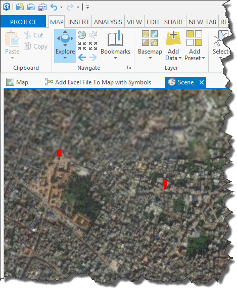

## ExcelDropHandler

<!-- TODO: Write a brief abstract explaining this sample -->
ArcGIS Pro Addin allows to Drag and drop *.xlsx file on ArcGIS Pro and execute the necessary Geoprocessing Tools automatically.   
  


<a href="http://pro.arcgis.com/en/pro-app/sdk/" target="_blank">View it live</a>

<!-- TODO: Fill this section below with metadata about this sample-->
```
Language:              C#
Subject:               Content
Contributor:           ArcGIS Pro SDK Team <arcgisprosdk@esri.com>
Organization:          Esri, http://www.esri.com
Date:                  7/10/2020
ArcGIS Pro:            2.6
Visual Studio:         2017, 2019
.NET Target Framework: 4.8
```

## Resources

* [API Reference online](https://pro.arcgis.com/en/pro-app/sdk/api-reference)
* <a href="https://pro.arcgis.com/en/pro-app/sdk/" target="_blank">ArcGIS Pro SDK for .NET (pro.arcgis.com)</a>
* [arcgis-pro-sdk-community-samples](https://github.com/Esri/arcgis-pro-sdk-community-samples)
* [ArcGIS Pro DAML ID Reference](https://github.com/Esri/arcgis-pro-sdk/wiki/ArcGIS-Pro-DAML-ID-Reference)
* [FAQ](https://github.com/Esri/arcgis-pro-sdk/wiki/FAQ)
* [ArcGIS Pro SDK icons](https://github.com/Esri/arcgis-pro-sdk/releases/tag/2.4.0.19948)


### Samples Data

* Sample data for ArcGIS Pro SDK Community Samples can be downloaded from the [repo releases](https://github.com/Esri/arcgis-pro-sdk-community-samples/releases) page.  

## How to use the sample
<!-- TODO: Explain how this sample can be used. To use images in this section, create the image file in your sample project's screenshots folder. Use relative url to link to this image using this syntax:  -->
   
This sample uses Excel files in Pro.   To use Excel files in Pro, you need Microsoft Access Database Engine 2016. Refer to the [Work with Microsoft Excel files in ArcGIS Pro](https://prodev.arcgis.com/en/pro-app/help/data/excel/work-with-excel-in-arcgis-pro.htm) help topic for more information on dowloading the required driver.  
  
1. Download the Community Sample data (see under the 'Resources' section for downloading sample data)  
1. Make sure that the Sample data is unzipped in c:\data       
1. In Visual Studio click the Build menu. Then select Build Solution.  
1. Click Start button to open ArcGIS Pro.  
1. ArcGIS Pro will open.   
1. Open a blank Map project.  
1. ArcGIS Pro will display a map view.    
1. Add a new Local Scene view.  
1. Look at two eventhandler methods  
1. OnDragOver – The Pro framework calls this method when an Excel file is dragged onto the Map holding down the left mouse button.   
1. OnDrop – The Pro framework calls this method when the user releases the left mouse button and the Excel file is dropped on Pro.   
1. Take a closer look at the OnDrop logic where the code for the execution of the Geoprocessing Tool can be found.    
1. Drag and Drop Meteorites_UK.xls onto Pro in the Map View.    
1. View the results of the Meteorite strikes layer loaded into Pro with symbology applied    
  
  
1. Switch to the local scene view    
1. Drag and Drop EarthquakeDamage.xls on to ArcGIS Pro    
1. View those results.    
  
  


<!-- End -->

&nbsp;&nbsp;&nbsp;&nbsp;&nbsp;&nbsp;
&nbsp;&nbsp;&nbsp;&nbsp;&nbsp;&nbsp;&nbsp;&nbsp;&nbsp;&nbsp;&nbsp;&nbsp;
[Home](https://github.com/Esri/arcgis-pro-sdk/wiki) | <a href="https://pro.arcgis.com/en/pro-app/sdk/api-reference" target="_blank">API Reference</a> | [Requirements](https://github.com/Esri/arcgis-pro-sdk/wiki#requirements) | [Download](https://github.com/Esri/arcgis-pro-sdk/wiki#installing-arcgis-pro-sdk-for-net) | <a href="https://github.com/esri/arcgis-pro-sdk-community-samples" target="_blank">Samples</a>
