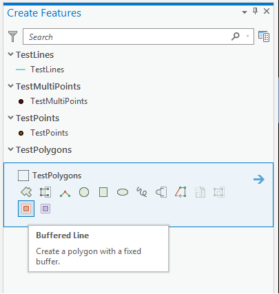
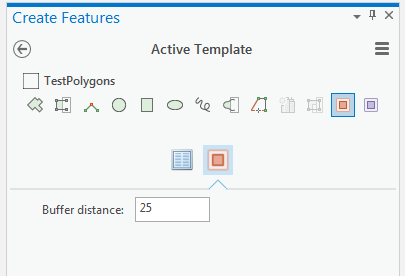

## ConstructionToolWithOptions

<!-- TODO: Write a brief abstract explaining this sample -->
This sample illustrates how to build a construction tool with options allowing users to provide parameters at run-time.    
Two samples are included.  
The first is the BufferedLineTool.  The line sketch geoemtry is buffered by a user defined distance to create a polygon feature.  
The second sample is the CircleTool.  A user defined radius is used to create a circular arc with the point sketch geometry as the centroid.  This tool is registered with both the esri_editing_construction_polyline and esri_editing_construction_polygon categories allowing both polyline and polygon features to be created.  
The CircleTool options follows the multiple tool options pattern (implementing IEditingCreateToolMultiple) allowing the users to select multiple templates in the manage templates dialog and change tool option values for those templates. The BufferedLineTool sample follows the single use pattern.  
  


<a href="http://pro.arcgis.com/en/pro-app/sdk/" target="_blank">View it live</a>

<!-- TODO: Fill this section below with metadata about this sample-->
```
Language:              C#
Subject:               Editing
Contributor:           ArcGIS Pro SDK Team <arcgisprosdk@esri.com>
Organization:          Esri, http://www.esri.com
Date:                  12/01/2020
ArcGIS Pro:            2.7
Visual Studio:         2017, 2019
.NET Target Framework: 4.8
```

## Resources

* [API Reference online](https://pro.arcgis.com/en/pro-app/sdk/api-reference)
* <a href="https://pro.arcgis.com/en/pro-app/sdk/" target="_blank">ArcGIS Pro SDK for .NET (pro.arcgis.com)</a>
* [arcgis-pro-sdk-community-samples](https://github.com/Esri/arcgis-pro-sdk-community-samples)
* [ArcGIS Pro DAML ID Reference](https://github.com/Esri/arcgis-pro-sdk/wiki/ArcGIS-Pro-DAML-ID-Reference)
* [FAQ](https://github.com/Esri/arcgis-pro-sdk/wiki/FAQ)
* [ArcGIS Pro SDK icons](https://github.com/Esri/arcgis-pro-sdk/releases/tag/2.4.0.19948)


### Samples Data

* Sample data for ArcGIS Pro SDK Community Samples can be downloaded from the [repo releases](https://github.com/Esri/arcgis-pro-sdk-community-samples/releases) page.  

## How to use the sample
<!-- TODO: Explain how this sample can be used. To use images in this section, create the image file in your sample project's screenshots folder. Use relative url to link to this image using this syntax:  -->
1. Download the Community Sample data (see under the 'Resources' section for downloading sample data)  
1. Make sure that the Sample data is unzipped in c:\data  
1. The project used for this sample is 'C:\Data\FeatureTest\FeatureTest.aprx'  
1. In Visual Studio click the Build menu.Then select Build Solution.  
1. Click Start button to open ArcGIS Pro.  
1. ArcGIS Pro will open, select the FeatureTest.aprx project  
1. Select the 'Edit' tab on the ArcGIS Pro ribbon and 'Create' new features  
1. On the 'Create Features' pane select the test polygon feature layer to see the 'Buffered Line' tool  
        
  
1. Select the tool and see the Options page displaying the buffer distance  
        
  
1. Enter a buffer distance and sketch a line.See a buffer of the sketched line used to generate a new polygon feature.  
  


<!-- End -->

&nbsp;&nbsp;&nbsp;&nbsp;&nbsp;&nbsp;
&nbsp;&nbsp;&nbsp;&nbsp;&nbsp;&nbsp;&nbsp;&nbsp;&nbsp;&nbsp;&nbsp;&nbsp;
[Home](https://github.com/Esri/arcgis-pro-sdk/wiki) | <a href="https://pro.arcgis.com/en/pro-app/sdk/api-reference" target="_blank">API Reference</a> | [Requirements](https://github.com/Esri/arcgis-pro-sdk/wiki#requirements) | [Download](https://github.com/Esri/arcgis-pro-sdk/wiki#installing-arcgis-pro-sdk-for-net) | <a href="https://github.com/esri/arcgis-pro-sdk-community-samples" target="_blank">Samples</a>
