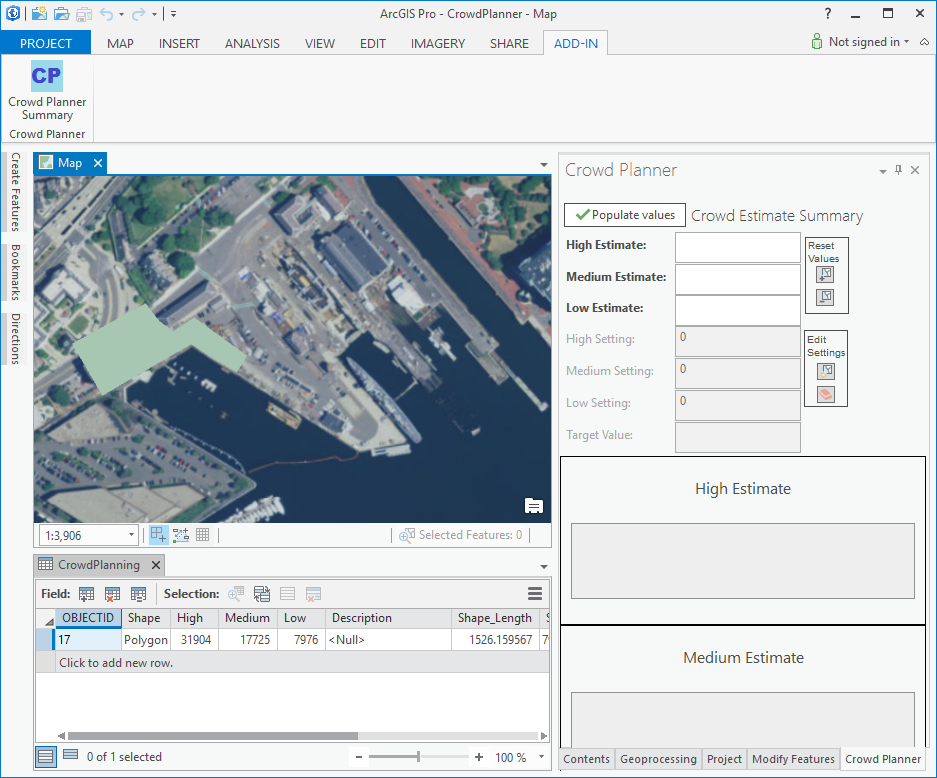
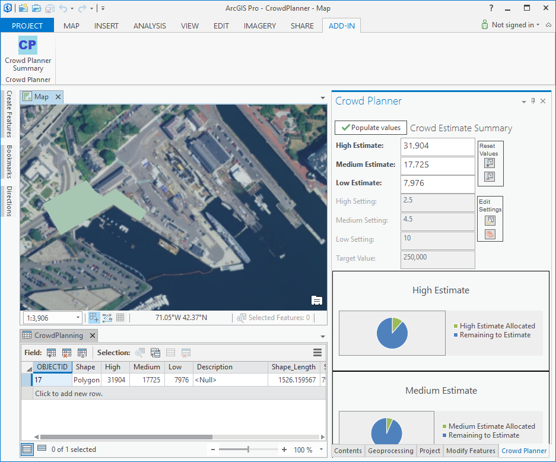
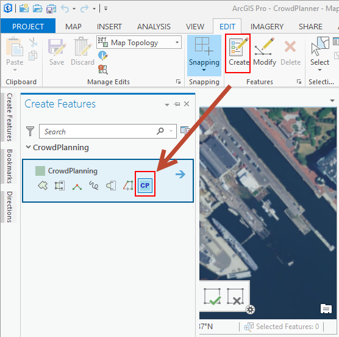
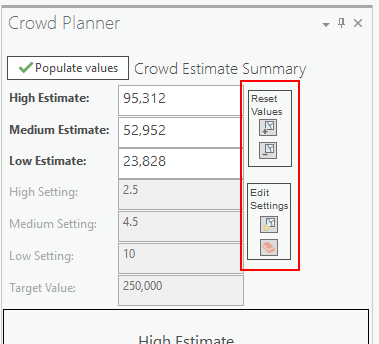

## CrowdPlannerTool

<!-- TODO: Write a brief abstract explaining this sample -->
This sample shows the use of a construction tool to implement a crowd planning workflow.  
  


<a href="http://pro.arcgis.com/en/pro-app/sdk/" target="_blank">View it live</a>

<!-- TODO: Fill this section below with metadata about this sample-->
```
Language:              C#
Subject:               Editing
Contributor:           ArcGIS Pro SDK Team <arcgisprosdk@esri.com>
Organization:          Esri, http://www.esri.com
Date:                  5/12/2021
ArcGIS Pro:            2.8
Visual Studio:         2017, 2019
.NET Target Framework: 4.8
```

## Resources

[Community Sample Resources](https://github.com/Esri/arcgis-pro-sdk-community-samples#resources)

### Samples Data

* Sample data for ArcGIS Pro SDK Community Samples can be downloaded from the [Releases](https://github.com/Esri/arcgis-pro-sdk-community-samples/releases) page.  

## How to use the sample
<!-- TODO: Explain how this sample can be used. To use images in this section, create the image file in your sample project's screenshots folder. Use relative url to link to this image using this syntax:  -->
1. Download the Community Sample data (see under the 'Resources' section for downloading sample data).  The sample data contains a map package called 'CrowdPlannerProject.ppkx' which is required for this sample.  Make sure that the Sample data is unzipped in c:\data and "C:\Data\CrowdPlanner" is available.  
1. Open this solution in Visual Studio.    
1. Click the build menu and select Build Solution.  
1. This solution is using the **System.Windows.Controls.DataVisualization.Toolkit Nuget**.  If needed, you can install the Nuget from the "Nuget Package Manager Console" by using this script: "Install-Package System.Windows.Controls.DataVisualization.Toolkit".  
1. Click the Start button to open ArCGIS Pro.  ArcGIS Pro will open.  
1. Open the map package "CrowdPlannerProject.ppkx" located in the "C:\Data\CrowdPlanner" folder since this project contains all required data.  
1. Click on the Add-in tab and see that a 'Crowd Planner Summary' button was added.  
1. The 'Crowd Planner Summary' button opens the 'Crowd Planner' pane.   
  
  
1. Click the 'Populate Values' button and note that now the pane entry fields have been populated using data from the sample record in the Crowd Planning feature class.  
  
  
1. Select the 'Edit' tab and create a new 'CrowdPlanning' feature by using the CP construction tool.  
  
  
1. Digitize a new polygon and note that its attributes are automatically populated.   
  
  
1. Finally you can also play with the various value adjustment buttons that are provided on the 'Crowd Planner' pane.  
  
  


<!-- End -->

&nbsp;&nbsp;&nbsp;&nbsp;&nbsp;&nbsp;
&nbsp;&nbsp;&nbsp;&nbsp;&nbsp;&nbsp;&nbsp;&nbsp;&nbsp;&nbsp;&nbsp;&nbsp;
[Home](https://github.com/Esri/arcgis-pro-sdk/wiki) | <a href="https://pro.arcgis.com/en/pro-app/latest/sdk/api-reference" target="_blank">API Reference</a> | [Requirements](https://github.com/Esri/arcgis-pro-sdk/wiki#requirements) | [Download](https://github.com/Esri/arcgis-pro-sdk/wiki#installing-arcgis-pro-sdk-for-net) | <a href="https://github.com/esri/arcgis-pro-sdk-community-samples" target="_blank">Samples</a>
