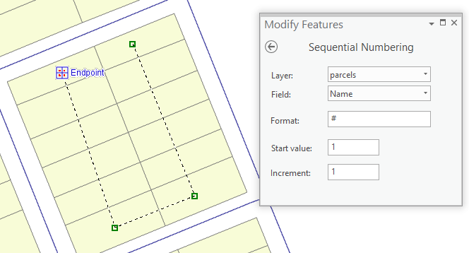
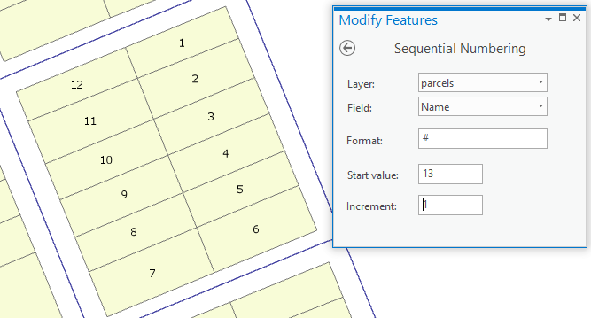
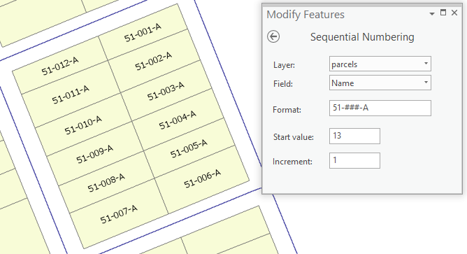

## SeqNum

<!-- TODO: Write a brief abstract explaining this sample -->
This sample is a custom edit tool that sequentially numbers point, line or polygon features along a sketch.  
The sample has been enhanced from previous ArcMap samples (viperpin and snakepin) to also number line and point feature classes and to format text strings for parcel pin numbering.  
  


<a href="http://pro.arcgis.com/en/pro-app/sdk/" target="_blank">View it live</a>

<!-- TODO: Fill this section below with metadata about this sample-->
```
Language:              C#
Subject:               Editing
Contributor:           ArcGIS Pro SDK Team <arcgisprosdk@esri.com>
Organization:          Esri, http://www.esri.com
Date:                  5/12/2021
ArcGIS Pro:            2.8
Visual Studio:         2017, 2019
.NET Target Framework: 4.8
```

## Resources

[Community Sample Resources](https://github.com/Esri/arcgis-pro-sdk-community-samples#resources)

### Samples Data

* Sample data for ArcGIS Pro SDK Community Samples can be downloaded from the [Releases](https://github.com/Esri/arcgis-pro-sdk-community-samples/releases) page.  

## How to use the sample
<!-- TODO: Explain how this sample can be used. To use images in this section, create the image file in your sample project's screenshots folder. Use relative url to link to this image using this syntax:  -->
1. Prepare some polygon data with an integer and text field for testing.  
1. In Visual Studio, build the solution.  
1. Click Start button to open ArcGIS Pro.  
1. In Pro start with a new map and add your polygon data.    
1. Open the Modify Features dockpane from the edit tab.  
1. Locate and activate the Sequential Numbering tool from the Sample Tools category in the dockpane.  
1. In the tool pane, select the polygon layer name, the text field, set the start and increment values.  
1. In the map sketch and finish a line accross the polygons you wish to attribute.  
The polygons will be attributed sequentially and the start value set to the next highest number.  
  
  
  
1. Change the format string to 51-###-A.  
1. Sketch and finish a line accross some polygons.  
1. The polygons will be attributed sequentially. The number of # determines leading zeros in the string format.  
  
  
  
Continue testing with other text format combinations, feature class types and integer fields.  
The text format string is only available for text string fields.  
  


<!-- End -->

&nbsp;&nbsp;&nbsp;&nbsp;&nbsp;&nbsp;
&nbsp;&nbsp;&nbsp;&nbsp;&nbsp;&nbsp;&nbsp;&nbsp;&nbsp;&nbsp;&nbsp;&nbsp;
[Home](https://github.com/Esri/arcgis-pro-sdk/wiki) | <a href="https://pro.arcgis.com/en/pro-app/latest/sdk/api-reference" target="_blank">API Reference</a> | [Requirements](https://github.com/Esri/arcgis-pro-sdk/wiki#requirements) | [Download](https://github.com/Esri/arcgis-pro-sdk/wiki#installing-arcgis-pro-sdk-for-net) | <a href="https://github.com/esri/arcgis-pro-sdk-community-samples" target="_blank">Samples</a>
