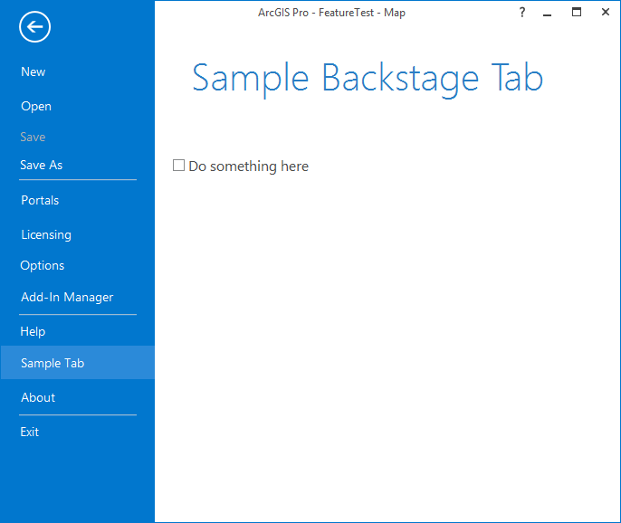

## BackStage_PropertyPage

<!-- TODO: Write a brief abstract explaining this sample -->
This sample illustrates how to   
  
1. add a new backstage item    
2. add property sheet items into the Options property pages  
3. save and restore project settings  
  


<a href="http://pro.arcgis.com/en/pro-app/sdk/" target="_blank">View it live</a>

<!-- TODO: Fill this section below with metadata about this sample-->
```
Language:              C#
Subject:               Framework
Contributor:           ArcGIS Pro SDK Team <arcgisprosdk@esri.com>
Organization:          Esri, http://www.esri.com
Date:                  1/16/2018
ArcGIS Pro:            2.1
Visual Studio:         2015, 2017
.NET Target Framework: 4.6.1
```

## Resources

* [API Reference online](http://pro.arcgis.com/en/pro-app/sdk/api-reference)
* <a href="http://pro.arcgis.com/en/pro-app/sdk/" target="_blank">ArcGIS Pro SDK for .NET (pro.arcgis.com)</a>
* [arcgis-pro-sdk-community-samples](http://github.com/Esri/arcgis-pro-sdk-community-samples)
* [ArcGISPro Registry Keys](http://github.com/Esri/arcgis-pro-sdk/wiki/ArcGIS-Pro-Registry-Keys)
* [FAQ](http://github.com/Esri/arcgis-pro-sdk/wiki/FAQ)
* [ArcGIS Pro SDK icons](https://github.com/Esri/arcgis-pro-sdk/releases/tag/1.4.0.7198)
* [ProConcepts: ArcGIS Pro Add in Samples](https://github.com/Esri/arcgis-pro-sdk-community-samples/wiki/ProConcepts-ArcGIS-Pro-Add-in-Samples)


* [ProSnippets: 2.0 Migration](http://github.com/Esri/arcgis-pro-sdk/wiki/ProSnippets-Migrating-to-2.0)  
* [ProSnippets: 2.0 Migration Samples](http://github.com/Esri/arcgis-pro-sdk/wiki/ProSnippets-2.0-Migration-Samples)  
* [ProConcepts: 2.0 Migration](http://github.com/Esri/arcgis-pro-sdk/wiki/ProConcepts-2.0-Migration-Guide)  

### Samples Data

* Sample data for ArcGIS Pro SDK Community Samples can be downloaded from the [repo releases](https://github.com/Esri/arcgis-pro-sdk-community-samples/releases) page.  

## How to use the sample
<!-- TODO: Explain how this sample can be used. To use images in this section, create the image file in your sample project's screenshots folder. Use relative url to link to this image using this syntax:  -->
Backstage items can be either a tab or a button. As per other controls they have a reference in the config.daml file.  However they are different from other controls  in that they are not children of the module tag - they are children of the backstage tag. This sample shows how to add a new tab following the MVVM pattern.   
The tab can be positioned using the "insert" and "placeWith" attributes in the config.daml.  The SampleBackstageTabView xaml file uses ArcGIS Pro styles to  allow the custom tab to look those those in the existing application.  
  
Property sheets are used to capture settings. They can be either project or application settings. You can insert your custom property sheets into the existing Options property sheets which are displayed from the backstage Options tab.  This is achieved in the config.daml by using the updateSheet xml tag and specifying the  esri_core_optionsPropertySheet id.  Use the group attribute on the insertPage tag to specify whether your view/viewmodel represents project or application settings.   
This sample has an example of both project and application settings, including illustrating how these settings can be saved.   

  
Modules can write out their own set of properties when a project is saved. Correspondingly, modules can read their own settings when a project is opened.  The module contains two methods OnReadStateAsync and OnWriteStateAsync which should be overriden to read and write module specific settings or properties.   

  
  
1. Open this solution in Visual Studio 2013.    
1. Click the build menu and select Build Solution.  
1. Click the Start button to open ArCGIS Pro.  ArcGIS Pro will open.  
1. Open any project - it can be an existing project containing data or a new empty project.  
1. Click the project tab.  See that there is a new Sample Tab item in the backstage.  Select it and it will show the new backstage tab.  
1. Click the project tab and select the Options backstage item.  The options property page will display.  
1. See that there is a Sample Project Settings under Project and a Sample App Settings under Application.   
1. Change the project settings and application settings.   
1. Save the project.  
1. Open another project (or create new); return to the Project|Options|Sample Project Settings and see that the settings have been reset.  
1. Open the project from step4; return to the Project|Options|Sample Project Settings and see that the settings have been restored.  
  
  


<!-- End -->

&nbsp;&nbsp;&nbsp;&nbsp;&nbsp;&nbsp;
&nbsp;&nbsp;&nbsp;&nbsp;&nbsp;&nbsp;&nbsp;&nbsp;&nbsp;&nbsp;&nbsp;&nbsp;
[Home](https://github.com/Esri/arcgis-pro-sdk/wiki) | <a href="http://pro.arcgis.com/en/pro-app/sdk/api-reference" target="_blank">API Reference</a> | [Requirements](https://github.com/Esri/arcgis-pro-sdk/wiki#requirements) | [Download](https://github.com/Esri/arcgis-pro-sdk/wiki#installing-arcgis-pro-sdk-for-net) | <a href="http://github.com/esri/arcgis-pro-sdk-community-samples" target="_blank">Samples</a>
