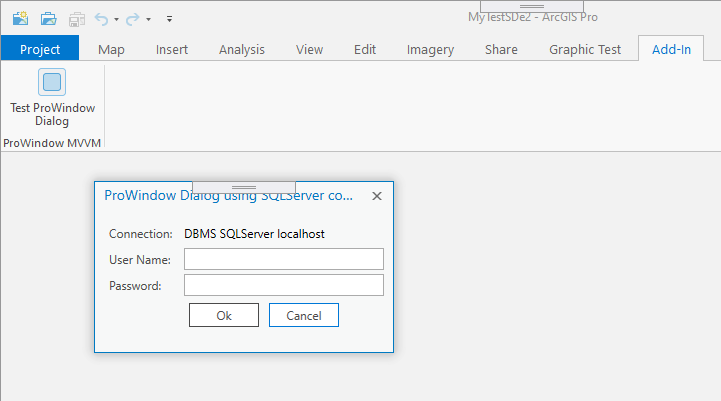
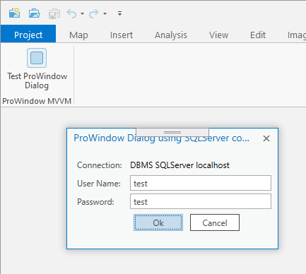
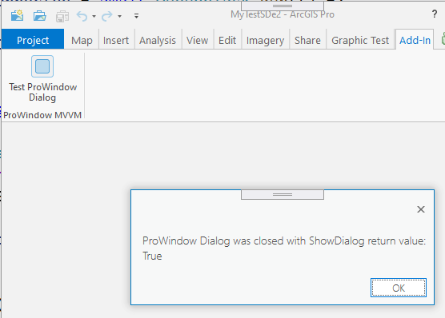
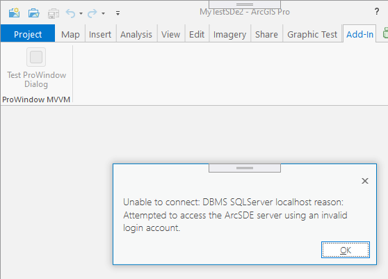

## ProWindowMVVM

<!-- TODO: Write a brief abstract explaining this sample -->
the ProWindowMVVM sample demonstrates how to implement a ProWindow using the Model-View-ViewModel pattern (MVVM).    
  


<a href="http://pro.arcgis.com/en/pro-app/sdk/" target="_blank">View it live</a>

<!-- TODO: Fill this section below with metadata about this sample-->
```
Language:              C#
Subject:               Framework
Contributor:           ArcGIS Pro SDK Team <arcgisprosdk@esri.com>
Organization:          Esri, http://www.esri.com
Date:                  7/10/2020
ArcGIS Pro:            2.6
Visual Studio:         2019
.NET Target Framework: 4.8
```

## Resources

* [API Reference online](https://pro.arcgis.com/en/pro-app/sdk/api-reference)
* <a href="https://pro.arcgis.com/en/pro-app/sdk/" target="_blank">ArcGIS Pro SDK for .NET (pro.arcgis.com)</a>
* [arcgis-pro-sdk-community-samples](https://github.com/Esri/arcgis-pro-sdk-community-samples)
* [ArcGIS Pro DAML ID Reference](https://github.com/Esri/arcgis-pro-sdk/wiki/ArcGIS-Pro-DAML-ID-Reference)
* [FAQ](https://github.com/Esri/arcgis-pro-sdk/wiki/FAQ)
* [ArcGIS Pro SDK icons](https://github.com/Esri/arcgis-pro-sdk/releases/tag/2.4.0.19948)


### Samples Data

* Sample data for ArcGIS Pro SDK Community Samples can be downloaded from the [repo releases](https://github.com/Esri/arcgis-pro-sdk-community-samples/releases) page.  

## How to use the sample
<!-- TODO: Explain how this sample can be used. To use images in this section, create the image file in your sample project's screenshots folder. Use relative url to link to this image using this syntax:  -->
1. In Visual Studio click the Build menu. Then select Build Solution.  
1. Click Start button to debug ArcGIS Pro.  
1. In ArcGIS Pro open any project.  
1. Open the Add-in Tab and click on the 'Test ProWindow Dialog' button.  
1. The Modal ProWindowDialog opens.  See TestProWindowDialog:OnClick on how the ProWindowDialog is instantiated and initialized.    
1. Find 'TODO: set data context' in the source code, this is where the ProWindowDialog datacontext property is set to ProWindowDialogVM. If you add a new ProWindow via the Pro SDK item templates you have to add this code snippet yourself.    
    
  
1. Enter some input data.  
    
  
1. In MVVM you need to control the window closing from the ViewModel class.  This is accomplished by the addition of 'CommandParameter="{Binding ElementName=ProWindowDialogWin}"' to each button that closes the ProWindow.    
1. In the code behind you can then use the command parameter to control the DialogResult and Close () of the ProWindow with the following snippets: (proWindow as ProWindow).DialogResult = true; and (proWindow as ProWindow).Close();  
1. Click either 'Ok' or 'Cancel' you get the appropriate DialogResult returned by the ShowDialog method:  
    
  
1. Finally you can use the dialog's data changes which have been stored in the Module class.  
      
  


<!-- End -->

&nbsp;&nbsp;&nbsp;&nbsp;&nbsp;&nbsp;
&nbsp;&nbsp;&nbsp;&nbsp;&nbsp;&nbsp;&nbsp;&nbsp;&nbsp;&nbsp;&nbsp;&nbsp;
[Home](https://github.com/Esri/arcgis-pro-sdk/wiki) | <a href="https://pro.arcgis.com/en/pro-app/sdk/api-reference" target="_blank">API Reference</a> | [Requirements](https://github.com/Esri/arcgis-pro-sdk/wiki#requirements) | [Download](https://github.com/Esri/arcgis-pro-sdk/wiki#installing-arcgis-pro-sdk-for-net) | <a href="https://github.com/esri/arcgis-pro-sdk-community-samples" target="_blank">Samples</a>
