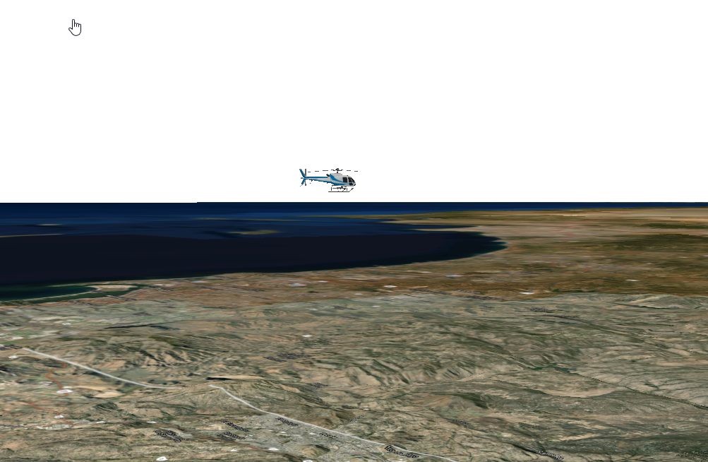
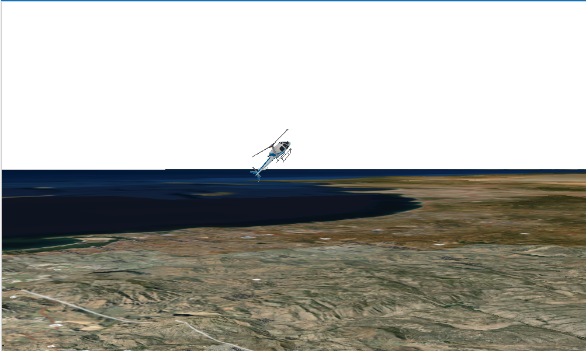

## Renderer

<!-- TODO: Write a brief abstract explaining this sample -->
This sample renders feature layers with various types of renderers. There are examples for the following types of renderers in this sample:  
  * Simple Renderers  
  * Unique Value Renderer  
  * Class breaks renderers  
      * Graduated color to define quantities  
      * Graduated symbols to define quantities  
      * Unclassed color gradient to define quantities  
  * Proportional Renderer  
  * Heat map renderer  
  


<a href="http://pro.arcgis.com/en/pro-app/sdk/" target="_blank">View it live</a>

<!-- TODO: Fill this section below with metadata about this sample-->
```
Language:              C#
Subject:               Map Authoring
Contributor:           ArcGIS Pro SDK Team <arcgisprosdk@esri.com>
Organization:          Esri, http://www.esri.com
Date:                  7/10/2020
ArcGIS Pro:            2.6
Visual Studio:         2017, 2019
.NET Target Framework: 4.8
```

## Resources

* [API Reference online](https://pro.arcgis.com/en/pro-app/sdk/api-reference)
* <a href="https://pro.arcgis.com/en/pro-app/sdk/" target="_blank">ArcGIS Pro SDK for .NET (pro.arcgis.com)</a>
* [arcgis-pro-sdk-community-samples](https://github.com/Esri/arcgis-pro-sdk-community-samples)
* [ArcGIS Pro DAML ID Reference](https://github.com/Esri/arcgis-pro-sdk/wiki/ArcGIS-Pro-DAML-ID-Reference)
* [FAQ](https://github.com/Esri/arcgis-pro-sdk/wiki/FAQ)
* [ArcGIS Pro SDK icons](https://github.com/Esri/arcgis-pro-sdk/releases/tag/2.4.0.19948)


### Samples Data

* Sample data for ArcGIS Pro SDK Community Samples can be downloaded from the [repo releases](https://github.com/Esri/arcgis-pro-sdk-community-samples/releases) page.  

## How to use the sample
<!-- TODO: Explain how this sample can be used. To use images in this section, create the image file in your sample project's screenshots folder. Use relative url to link to this image using this syntax:  -->
1. In Visual Studio click the Build menu. Then select Build Solution.    
1. Click Start button to open ArcGIS Pro.  
1. ArcGIS Pro will open.   
1. Open any project file that contains points, polygon and line feature layers.   
1. In Add-in tab, click the "Apply Renderer" button.  
1. The first point feature layer in your project's TOC will be rendered with an "Unique Value Renderer".  
To experiment with the various renderers available with this sample, follow the steps below:  
  
1. Stop debugging Pro.  
1. In Visual Studio's solution explorer, open the ApplyRenderer.cs file. This is the class file for the Apply Renderer button.  
1. The OnClick method in the ApplyRenderer.cs file gets the first point feature layer in your project and then applies the Unique Value Renderer to it.<br />  
   **You can modify the code in the OnClick method in this file to use one of the various renderers available in this sample and/or select any feature layer in your project.**  
    ```c#  
    protected async override void OnClick()  
    {  
      //TODO: This line below gets the first point layer in the project to apply a renderer.  
      //You can modify it to use other layers with polygon or line geometry if needed.  
      var lyr = MapView.Active.Map.GetLayersAsFlattenedList().OfType<FeatureLayer>().FirstOrDefault(s => s.ShapeType == esriGeometryType.esriGeometryPoint);  
      //TODO: Modify this line below to experiment with the different renderers  
      await UniqueValueRenderers.UniqueValueRenderer(lyr);  
    }  
    ```
1. After modifying the OnClickMethod build the solution and click the start button to open Pro.    
1. Open any project and test the Apply Renderer button again.  
  
#### Attribute Driven Symbology  
  
1. Create a new Local Scene. Add the c:\Data\FlightPathPoints.lyrx layer file to the scene.  This layer draws a point geometry rendered with a helicopter symbol.  The data for this layer holds the Tilt angles (X, Y and Z) for the helicopter.  
1. Use the Navigate button to tilt the view so that you can see the helicopter to display it over the map.  
  
  
1. Click the AttributeDriverSymbology button on the Add-In tab.  
1. Notice that the helicopter is now displayed using the Tilt fields.  
  
  


<!-- End -->

&nbsp;&nbsp;&nbsp;&nbsp;&nbsp;&nbsp;
&nbsp;&nbsp;&nbsp;&nbsp;&nbsp;&nbsp;&nbsp;&nbsp;&nbsp;&nbsp;&nbsp;&nbsp;
[Home](https://github.com/Esri/arcgis-pro-sdk/wiki) | <a href="https://pro.arcgis.com/en/pro-app/sdk/api-reference" target="_blank">API Reference</a> | [Requirements](https://github.com/Esri/arcgis-pro-sdk/wiki#requirements) | [Download](https://github.com/Esri/arcgis-pro-sdk/wiki#installing-arcgis-pro-sdk-for-net) | <a href="https://github.com/esri/arcgis-pro-sdk-community-samples" target="_blank">Samples</a>
