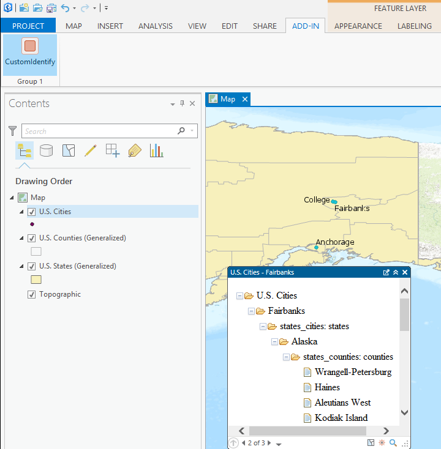

## CustomIdentify

<!-- TODO: Write a brief abstract explaining this sample -->
 This sample shows how to author a tool that can be used to identify features and display the content in a pop-up window.   
 The identify will also show Relationship Class information if one exists in that feature class. The result will be displayed in a pop-up window using html and dojo.  
 Note: The identify is authored to query the features in the topmost layer of the map.  
   


<a href="http://pro.arcgis.com/en/pro-app/sdk/" target="_blank">View it live</a>

<!-- TODO: Fill this section below with metadata about this sample-->
```
Language:              C# 6.0
Subject:               Framework
Contributor:           ArcGIS Pro SDK Team <arcgisprosdk@esri.com>
Organization:          Esri, http://www.esri.com
Date:                  4/11/2017
ArcGIS Pro:            1.4
Visual Studio:         2015
.NET Target Framework: 4.6.1
```

## Resources

* [API Reference online](http://pro.arcgis.com/en/pro-app/sdk/api-reference)
* <a href="http://pro.arcgis.com/en/pro-app/sdk/" target="_blank">ArcGIS Pro SDK for .NET (pro.arcgis.com)</a>
* [arcgis-pro-sdk-community-samples](http://github.com/Esri/arcgis-pro-sdk-community-samples)
* [ArcGISPro Registry Keys](http://github.com/Esri/arcgis-pro-sdk/wiki/ArcGIS-Pro-Registry-Keys)
* [FAQ](http://github.com/Esri/arcgis-pro-sdk/wiki/FAQ)
* [ArcGIS Pro SDK icons](https://github.com/Esri/arcgis-pro-sdk/releases/tag/1.4.0.7198)
* [ProConcepts: ArcGIS Pro Add in Samples](https://github.com/Esri/arcgis-pro-sdk-community-samples/wiki/ProConcepts-ArcGIS-Pro-Add-in-Samples)


### Samples Data

* Sample data for ArcGIS Pro SDK Community Samples can be downloaded from the [repo releases](https://github.com/Esri/arcgis-pro-sdk-community-samples/releases) page.  

## How to use the sample
<!-- TODO: Explain how this sample can be used. To use images in this section, create the image file in your sample project's screenshots folder. Use relative url to link to this image using this syntax:  -->
 1. In Visual Studio click the Build menu. Then select Build Solution.  
 2. Click Start button to open ArcGIS Pro.  
 3. ArcGIS Pro will open.   
 4. Open a map view. The map should contain a few feature classes, preferably they should also contain Relates to other Feature classes.  
 5. Click on the Add-In tab on the ribbon.  
 5. Within this tab there is a Custom Identify tool. Click it to activate the tool.  
 6. In the map click and drag a box around the features you want to identify.  
 7. The pop-up window should display and you should see the results of the identify. The features you selected could have relates to other feature classes.   
 This will be displayed also in a hierarchical manner.   
 8. As you click through the pop-up results the content is being generated dynamically for each feature.  
  
  
  
   


<!-- End -->

&nbsp;&nbsp;&nbsp;&nbsp;&nbsp;&nbsp;
&nbsp;&nbsp;&nbsp;&nbsp;&nbsp;&nbsp;&nbsp;&nbsp;&nbsp;&nbsp;&nbsp;&nbsp;
[Home](https://github.com/Esri/arcgis-pro-sdk/wiki) | <a href="http://pro.arcgis.com/en/pro-app/sdk/api-reference" target="_blank">API Reference</a> | [Requirements](https://github.com/Esri/arcgis-pro-sdk/wiki#requirements) | [Download](https://github.com/Esri/arcgis-pro-sdk/wiki#installing-arcgis-pro-sdk-for-net) | <a href="http://github.com/esri/arcgis-pro-sdk-community-samples" target="_blank">Samples</a>
