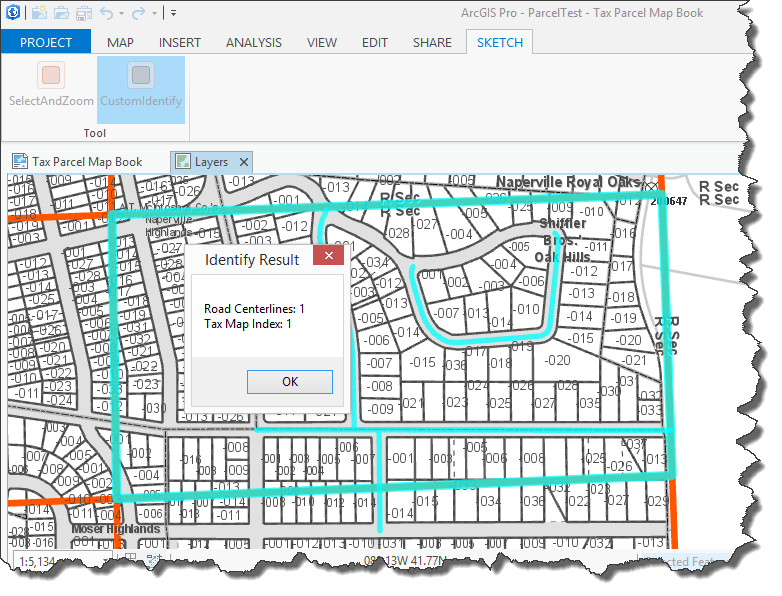
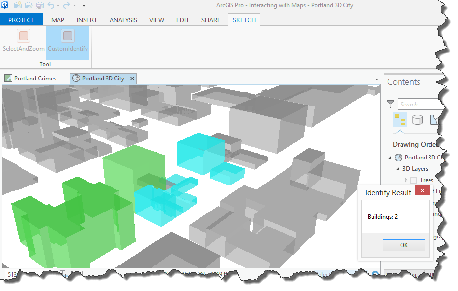

##IdentifyWithSketchTool

<!-- TODO: Write a brief abstract explaining this sample -->
This sample shows how to:   
* Add a custom sketch tool to work with map views  
* Use the sketch to create a new selection and zoom to the result in 2D or 3D  
* Create a custom identify tool for 2D and 3D  
  


<a href="http://pro.arcgis.com/en/pro-app/sdk/" target="_blank">View it live</a>

<!-- TODO: Fill this section below with metadata about this sample-->
```
Language:      C#
Subject:       Map Exploration
Contributor:   ArcGIS Pro SDK Team <arcgisprosdk@esri.com>
Organization:  Esri, http://www.esri.com
Date:          8/27/2015
ArcGIS Pro:    1.1
Visual Studio: 2013
```

##Resources

* [API Reference online](http://pro.arcgis.com/en/pro-app/sdk/api-reference)
* <a href="http://pro.arcgis.com/en/pro-app/sdk/" target="_blank">ArcGIS Pro SDK for .NET (pro.arcgis.com)</a>
* [arcgis-pro-sdk-community-samples](http://github.com/Esri/arcgis-pro-sdk-community-samples)
* [FAQ](http://github.com/Esri/arcgis-pro-sdk/wiki/FAQ)
* [ArcGIS Pro SDK icons](https://github.com/Esri/arcgis-pro-sdk/releases/tag/1.1.0.3308)
* [ProConcepts: ArcGIS Pro Add in Samples](https://github.com/Esri/arcgis-pro-sdk-community-samples/wiki/ProConcepts-ArcGIS-Pro-Add-in-Samples)

##How to use the sample
<!-- TODO: Explain how this sample can be used. To use images in this section, create the image file in your sample project's screenshots folder. Use relative url to link to this image using this syntax:  -->
1. In Visual Studio click the Build menu. Then select Build Solution.  
1. Click Start button to open ArcGIS Pro.  
1. ArcGIS Pro will open.   
1. Open a project with a map view that has feature layers.  
1. Click on the Sketch tab and then on the 'Select And Zoom' button.  
1. On your map view 'sketch' (using the rubber band rectangle) an area containing features  
1. Features will be selected and the map view will be zoom to the selection area's extent  
1. Next click the 'Custom Identify' button and you will see the 'Identify Result' popup  
      
1. Now open a project that contains a scene with 3D features  
1. Click on the Sketch tab and then on the 'Select And Zoom' button  
1. On your 3D map view 'sketch' (using the rubber band rectangle) an area containing features  
1. Features will be selected and the map view will be zoom to the selection area's extent  
1. Next click the 'Custom Identify' button and you will see the 'Identify Result' pop-up  
      
  


[](Esri Tags: ArcGIS-Pro-SDK)
[](Esri Language: C-Sharp)​


<p align = center>
<b> ArcGIS Pro 1.1 SDK for Microsoft .NET Framework</b>
</p>
&nbsp;&nbsp;&nbsp;&nbsp;&nbsp;&nbsp;&nbsp;&nbsp;&nbsp;&nbsp;&nbsp;&nbsp;&nbsp;&nbsp;&nbsp;&nbsp;&nbsp;&nbsp;&nbsp;&nbsp;[Home](https://github.com/Esri/arcgis-pro-sdk/wiki) | <a href="http://pro.arcgis.com/en/pro-app/sdk" target="_blank">ArcGIS Pro SDK</a> | <a href="http://pro.arcgis.com/en/pro-app/sdk/api-reference" target="_blank">API Reference</a> | [Requirements](#requirements) | [Download](#download) |  <a href="http://github.com/esri/arcgis-pro-sdk-community-samples" target="_blank">Samples</a>
