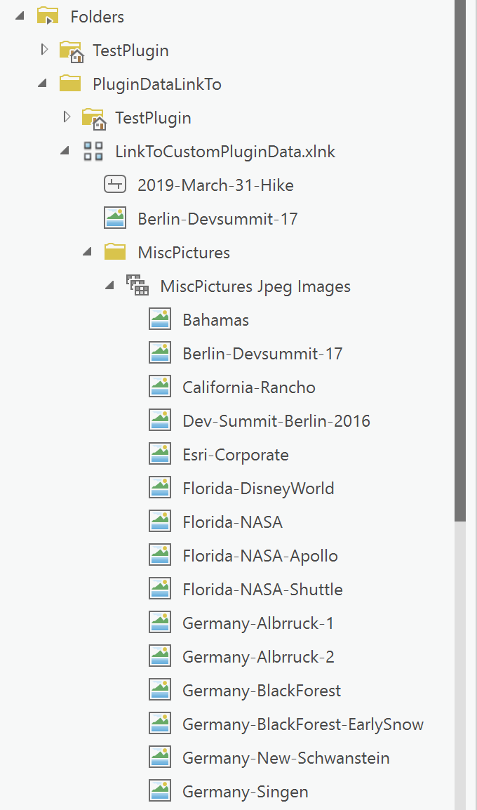
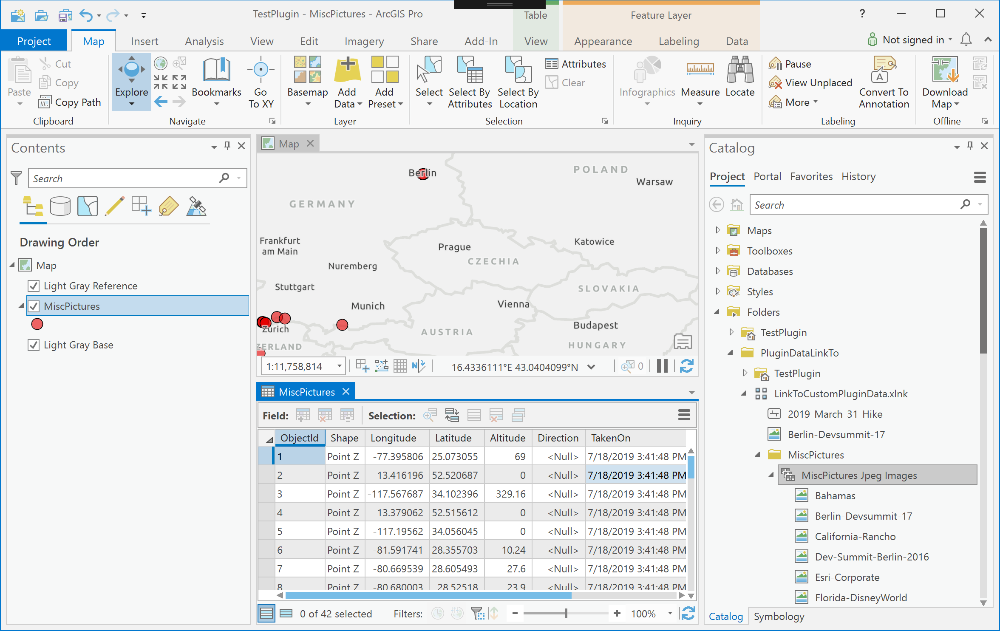

## ProDataReader

<!-- TODO: Write a brief abstract explaining this sample -->
ProDataReader implements a three plugin datasources to read the following:  
- Classic ArcGIS Personal Geodatabase: A personal geodatabase is a Microsoft Access database that can store, query, and manage both spatial and nonspatial data.  ProMdbPluginDatasource implements read-only access to personal geodatabase feature class data.  
- Jpg photos with GPS metadata: smart phone and digital cameras have the option to capture GPS information when a photo is taken.  ProJpgPluginDatasource allows to access these GPS enable photos as a read-only feature class.  
- Gpx data: GPX (the GPS eXchange Format) is a data format for exchanging GPS data between programs and implemented by many GPS tracking devices. ProGpxPluginDatasource allows to access Gpx files as a read-only feature class.   
  


<a href="http://pro.arcgis.com/en/pro-app/sdk/" target="_blank">View it live</a>

<!-- TODO: Fill this section below with metadata about this sample-->
```
Language:              C#
Subject:               Framework
Contributor:           ArcGIS Pro SDK Team <arcgisprosdk@esri.com>
Organization:          Esri, http://www.esri.com
Date:                  6/27/2019
ArcGIS Pro:            2.4
Visual Studio:         2019
.NET Target Framework: 4.7.2
```

## Resources

* [API Reference online](https://pro.arcgis.com/en/pro-app/sdk/api-reference)
* <a href="https://pro.arcgis.com/en/pro-app/sdk/" target="_blank">ArcGIS Pro SDK for .NET (pro.arcgis.com)</a>
* [arcgis-pro-sdk-community-samples](https://github.com/Esri/arcgis-pro-sdk-community-samples)
* [ArcGIS Pro DAML ID Reference](https://github.com/Esri/arcgis-pro-sdk/wiki/ArcGIS-Pro-DAML-ID-Reference)
* [FAQ](https://github.com/Esri/arcgis-pro-sdk/wiki/FAQ)
* [ArcGIS Pro SDK icons](https://github.com/Esri/arcgis-pro-sdk/releases/tag/2.4.0.19948)


### Samples Data

* Sample data for ArcGIS Pro SDK Community Samples can be downloaded from the [repo releases](https://github.com/Esri/arcgis-pro-sdk-community-samples/releases) page.  

## How to use the sample
<!-- TODO: Explain how this sample can be used. To use images in this section, create the image file in your sample project's screenshots folder. Use relative url to link to this image using this syntax:  -->
1. Download the Community Sample data (see under the 'Resources' section for downloading sample data)  
1. Make sure that the Sample data is unzipped in c:\data   
1. The data used in this sample is located in this folder 'C:\Data\TestPersonalGdb'  
1. Also in order to access Microsoft Access database files you need to download a 64 bit driver which can be downloaded from Microsoft here: https://www.microsoft.com/en-us/download/details.aspx?id=13255   
1. In Visual Studio click the Build menu. Then select Build Solution.  
1. Click Start button to open ArcGIS Pro.  
1. In ArcGIS Pro create a new Map using the Empty Map Template.  
1. Open the Catalog Dockpane and add new Folder Connection to connect this folder 'C:\Data\TestPersonalGdb'  
    
  
1. On the Catalog Dockpane open the TestPersonalGdg folder to explore the ProMdb Project Item which allows you to 'drill-down' to the feature class content of ArcGIS personal geodatabases.  
1. Open the TestPersonalGdg folder to find the TestPGdb.arcgismdb personal geodatabase.  The Personal Geodatabase file extension is usually .mdb, however, ArcGIS Pro doesn't allow project custom items with that extension, hence the renaming of the file extension to ArcGISMdb.  
    
  
1. In the source code look at the ProMdbProjectItem class, which is used to implement the TestPGdb.arcgismdb node.  
    
  
1. Under the TestPGdb.arcgismdb node you can see all point/line/polygon feature classes of the personal geodatabase.  In source code, the ProMdbTable class is used to prepresent each table.  
1. Right clicking on the TestPGdb.arcgismdb node allows to add TestPGdb.arcgismdb as a Project Item.  In the source code this is done in AddToProject button class.  
1. Right clicking on any of the feature classes allows the feature class to be added to the current map.  In the source code this is done in the AddToCurrentMap button class.  
1. After you add a ProMdbTable item to the current map, the ProMdbPluginDatasource plug-in is used to convert the MS access table content into a feature class that can be added to a map and displayed as an attribute table.  
   
  


<!-- End -->

&nbsp;&nbsp;&nbsp;&nbsp;&nbsp;&nbsp;
&nbsp;&nbsp;&nbsp;&nbsp;&nbsp;&nbsp;&nbsp;&nbsp;&nbsp;&nbsp;&nbsp;&nbsp;
[Home](https://github.com/Esri/arcgis-pro-sdk/wiki) | <a href="https://pro.arcgis.com/en/pro-app/sdk/api-reference" target="_blank">API Reference</a> | [Requirements](https://github.com/Esri/arcgis-pro-sdk/wiki#requirements) | [Download](https://github.com/Esri/arcgis-pro-sdk/wiki#installing-arcgis-pro-sdk-for-net) | <a href="https://github.com/esri/arcgis-pro-sdk-community-samples" target="_blank">Samples</a>
