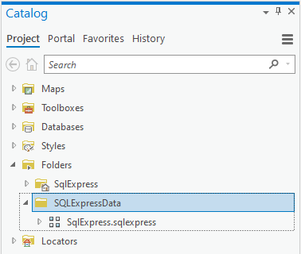
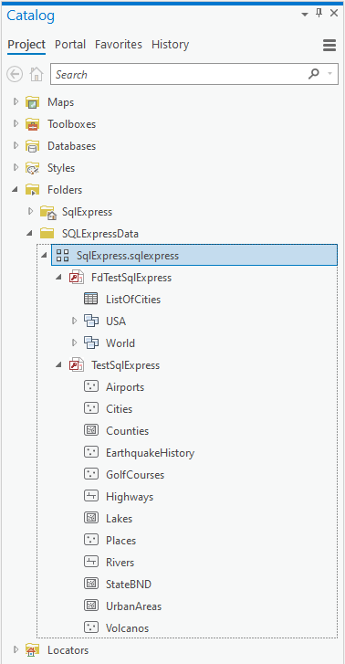

## ProMdbReader

<!-- TODO: Write a brief abstract explaining this sample -->
ProMdbReader implements a three plugin datasources to read the following:  
- Classic ArcGIS Personal Geodatabase: A personal geodatabase is a Microsoft Access database that can store, query, and manage both spatial and nonspatial data.  ProMdbPluginDatasource implements read-only access to personal geodatabase feature class data.  
  

* <a href="https://pro.arcgis.com/en/pro-app/sdk/" target="_blank">ArcGIS Pro SDK for .NET (pro.arcgis.com)</a>

### Samples Data

* Sample data for ArcGIS Pro SDK Team Content can be downloaded from the [repo releases](https://github.com/ArcGIS/arcgis-pro-sdk-team-content/releases) page.  

## How to use this solution
<!-- TODO: Explain how this sample can be used. To use images in this section, create the image file in your sample project's screenshots folder. Use relative url to link to this image using this syntax:  -->
1. Download the Community Sample data (see under the 'Resources' section for downloading sample data)  
1. Make sure that the Sample data is unzipped in c:\data   
1. The data used in this sample is located in this folder 'C:\Data\TestPersonalGdb'  
1. Also in order to access Microsoft Access database files you need to download a 64 bit driver which can be downloaded from Microsoft here: https://www.microsoft.com/en-us/download/details.aspx?id=13255   
1. In Visual Studio click the Build menu. Then select Build Solution.  
1. Click Start button to open ArcGIS Pro.  
1. In ArcGIS Pro open this project: 'C:\Data\PluginDataLinkTo\TestPersonalAccessDB\TestPersonalAccessDB.aprx'  
1. Open the Catalog Dockpane and open Folder Connection to to drill down to this folder: 'PluginDataLinkTo'  
    
  
1. The folder 'PluginDataLinkTo' is linked to 'C:\Data\PluginDataLinkTo' this folder contains a file called 'LinkToCustomPluginData.xlnk' with a file extension that triggers the 'ProDataProjectItem' Custom Project Item class. 'LinkToCustomPluginData.xlnk' in turn contains all the paths which are scanned and processed by the Custom Project Item class.  
1. Open the 'LinkToCustomPluginData.xlnk' folder to find various personal geodatabases.   
    
  
1. In the source code look at the ProMdbProjectItem class, which is used to implement the LinkToCustomPluginData.xlnk node in the Catalog dockpane.  
    
  
1. Under the PersonalGeodatabase node you can see all stand alone tables, feature datasets containing point, line, and polygon feature classes of the personal geodatabase.  In source code, the ProDataSubItem class is used to prepresent each table node in the catalog browser.  
1. Right clicking on any of the feature classes or feature datasets allows the feature class(es) to be added to the current map.  In the source code this is done in the AddToCurrentMap button class.  
1. After you add a ProMdbTable item to the current map, the ProMdbPluginDatasource plug-in is used to convert the MS access table content into a feature class that can be added to a map and displayed as an attribute table.  
   
  

<!-- End -->

&nbsp;&nbsp;&nbsp;&nbsp;&nbsp;&nbsp;
&nbsp;&nbsp;&nbsp;&nbsp;&nbsp;&nbsp;&nbsp;&nbsp;&nbsp;&nbsp;&nbsp;&nbsp;
[Home](https://github.com/Esri/arcgis-pro-sdk/wiki) | <a href="https://pro.arcgis.com/en/pro-app/sdk/api-reference" target="_blank">API Reference</a> | [Requirements](https://github.com/Esri/arcgis-pro-sdk/wiki#requirements) | [Download](https://github.com/Esri/arcgis-pro-sdk/wiki#installing-arcgis-pro-sdk-for-net) | <a href="https://github.com/esri/arcgis-pro-sdk-community-samples" target="_blank">Samples</a>
