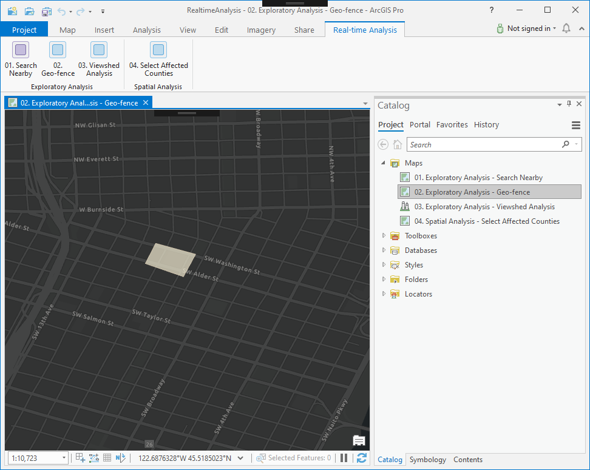
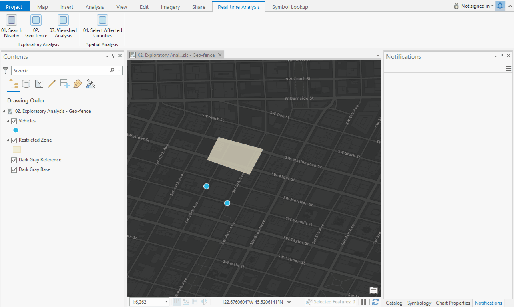

## RealtimeAnalysis

<!-- TODO: Write a brief abstract explaining this sample -->
This sample illustrates real-time analysis. Real-time API allows you to integrate real-time to any part of ArcGIS Pro - whether you just want to show some information on a control or perform a very complex spatial analysis by executing geoprocessing tools.     
  


<a href="http://pro.arcgis.com/en/pro-app/sdk/" target="_blank">View it live</a>

<!-- TODO: Fill this section below with metadata about this sample-->
```
Language:              C#
Subject:               StreamLayers
Contributor:           ArcGIS Pro SDK Team <arcgisprosdk@esri.com>
Organization:          Esri, http://www.esri.com
Date:                  7/10/2020
ArcGIS Pro:            2.6
Visual Studio:         2017, 2019
.NET Target Framework: 4.8
```

## Resources

* [API Reference online](https://pro.arcgis.com/en/pro-app/sdk/api-reference)
* <a href="https://pro.arcgis.com/en/pro-app/sdk/" target="_blank">ArcGIS Pro SDK for .NET (pro.arcgis.com)</a>
* [arcgis-pro-sdk-community-samples](https://github.com/Esri/arcgis-pro-sdk-community-samples)
* [ArcGIS Pro DAML ID Reference](https://github.com/Esri/arcgis-pro-sdk/wiki/ArcGIS-Pro-DAML-ID-Reference)
* [FAQ](https://github.com/Esri/arcgis-pro-sdk/wiki/FAQ)
* [ArcGIS Pro SDK icons](https://github.com/Esri/arcgis-pro-sdk/releases/tag/2.4.0.19948)


### Samples Data

* Sample data for ArcGIS Pro SDK Community Samples can be downloaded from the [repo releases](https://github.com/Esri/arcgis-pro-sdk-community-samples/releases) page.  

## How to use the sample
<!-- TODO: Explain how this sample can be used. To use images in this section, create the image file in your sample project's screenshots folder. Use relative url to link to this image using this syntax:  -->
Using Bing Maps API: To use the Bing Maps APIs, you must have a (Bing Maps Key)[https://msdn.microsoft.com/en-us/library/dd877180.aspx].  
Note: When you use the Bing Maps APIs with a Bing Maps Key, usage transactions are logged. See Understanding (Bing Maps Transactions)[https://msdn.microsoft.com/en-us/library/ff859477.aspx] for more information.  
Creating a Bing Maps Key  
  
1. Go to the Bing Maps Dev Center at https://www.bingmapsportal.com/.   
** If you have a Bing Maps account, sign in with the Microsoft account that you used to create the account or create a new one.For new accounts, follow the instructions in (Creating a Bing Maps Account)[https://msdn.microsoft.com/en-us/library/gg650598.aspx].  
2. Select Keys under My Account.  
3. Provide the following information to create a key:  
** Application name: Required.The name of the application.  
** Application URL: The URL of the application.  
** Key type: Required. Select the key type that you want to create.You can find descriptions of key and application types (here)[https://www.microsoft.com/maps/create-a-bing-maps-key.aspx].  
** Application type: Required. Select the application type that best represents the application that will use this key.You can find descriptions of key and application types (here)[https://www.microsoft.com/maps/create-a-bing-maps-key.aspx].    
4.	Type the characters of the security code, and then click Create. The new key displays in the list of available keys.Use this key to authenticate your Bing Maps application as described in the documentation for the Bing Maps API you are using.  
   
  
1. Download the Community Sample data (see under the 'Resources' section for downloading sample data)  
1. Make sure that the Sample data is unzipped in c:\data   
1. The project used for this sample is 'C:\Data\StreamLayers\RealtimeAnalysis.aprx'.    
1. Once opened this solution in Visual Studio, open Module1.cs and update value for BingKey variable  
1. This solution is using the **Newtonsoft.Json NuGet**.  If needed, you can install the NuGet from the "NuGet Package Manager Console" by using this script: "Install-Package Newtonsoft.Json".  
1. Click the Build menu.Then select Build Solution.  
1. Click Start button to open ArcGIS Pro.  
1. ArcGIS Pro will open, open the 'C:\Data\StreamLayers\RealtimeAnalysis.aprx' project.  
1. Open a map from the Catalog pane.  
1. i.e. open the '02. ExploratoryAnalysis - Geo-fence' map.  
  
  
1. Activate the Real-time Analysis tab.  
1. Click on a button that matches with the map name(e.g. if you open a map named '02. ExploratoryAnalysis - Geo-fence', click on the button named '02. Geo-fence'). This subscribes to a layer real-time feed.  
1. Click on this button again to Unsubscribe from the real-time feed.  
  
  


<!-- End -->

&nbsp;&nbsp;&nbsp;&nbsp;&nbsp;&nbsp;
&nbsp;&nbsp;&nbsp;&nbsp;&nbsp;&nbsp;&nbsp;&nbsp;&nbsp;&nbsp;&nbsp;&nbsp;
[Home](https://github.com/Esri/arcgis-pro-sdk/wiki) | <a href="https://pro.arcgis.com/en/pro-app/sdk/api-reference" target="_blank">API Reference</a> | [Requirements](https://github.com/Esri/arcgis-pro-sdk/wiki#requirements) | [Download](https://github.com/Esri/arcgis-pro-sdk/wiki#installing-arcgis-pro-sdk-for-net) | <a href="https://github.com/esri/arcgis-pro-sdk-community-samples" target="_blank">Samples</a>
